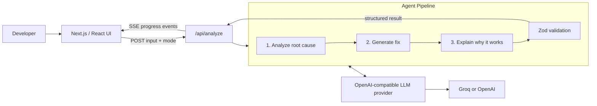

# DevAssist.ai

DevAssist.ai is an AI debugging companion for developers. Paste an error, log, or configuration snippet and get a structured diagnosis: the likely root cause, an actionable fix with a before/after code view, and a plain-language explanation of why the fix works.

## Live Demo

The live deployment URL is [https://ai-devassist.vercel.app/](https://ai-devassist.vercel.app/). The demo uses a Groq-compatible model for free, but you can configure your own OpenAI or Groq API key in `.env.local` to use your preferred provider. Check out .env.example for the configuration template.

> The hosted demo is fully functional and requires no setup. You can immediately test the built-in sample cases without providing an API key. Developers who clone the repository can optionally configure their own Groq or OpenAI API key for local development.

## Judge Quick Test

The fastest way to evaluate DevAssist.ai:

1. Open https://ai-devassist.vercel.app
2. Click any built-in sample case.
3. Press Analyze.
4. Watch the three-stage AI pipeline:
   - Analyze
   - Generate Fix
   - Explain
5. Inspect the Root Cause, Fix Steps, Diff, and Why It Works tabs.

No account is required.

## Quick Start 

```bash
git clone https://github.com/NebulaScout/DevAssist.ai.git
cd DevAssist.ai
npm install
cp .env.example .env.local
```

Add a provider key to `.env.local`. The default configuration uses Groq:

```dotenv
AI_PROVIDER=groq
GROQ_API_KEY=your_groq_api_key
```

Then start the app:

```bash
npm run dev
```

Open [http://localhost:3000](http://localhost:3000), click any sample case, and select **Analyze**. The result streams through the three stages: **Analyze**, **Generate fix**, and **Explain**.

To use OpenAI instead, set `AI_PROVIDER=openai`, add `OPENAI_API_KEY`, and optionally set `AI_MODEL` (for example, `gpt-5.6`) in `.env.local`.

## How to Use

1. Select **Debug Error** for an exception, stack trace, or log, or **Explain Config** for configuration files.
2. Paste the input, or load one of the built-in sample cases.
3. Click **Analyze** and follow the live pipeline status.
4. Review the four result views:
   - **Root Cause** identifies what failed and the affected area.
   - **Fix Steps** gives a concise remediation plan.
   - **Diff** compares the original input with a proposed corrected version.
   - **Why It Works** explains the reasoning and highlights concepts to learn.

Never paste production secrets, private keys, or credentials into the app.

## Sample Inputs (copy-paste ready)

### Docker port mismatch

Choose **Explain Config**, then paste:

```yaml
# Dockerfile
EXPOSE 3000

# docker-compose.yml
services:
  app:
    ports:
      - "8080:80"
```

### Django settings error

Choose **Debug Error**, then paste:

```text
django.core.exceptions.ImproperlyConfigured: The SECRET_KEY setting must not be empty.

DisallowedHost: Invalid HTTP_HOST header: 'api.example.com'. You may need to add 'api.example.com' to ALLOWED_HOSTS.
```

### Nginx upstream mismatch

Choose **Explain Config**, then paste:

```nginx
upstream api_backend {
  server api:3000;
}

server {
  location /api/ {
    proxy_pass http://backend_api;
  }
}
```

## How I Used Codex & GPT-5.6

This project was built with AI-assisted development, with the following concrete contributions:

- **Codex scaffolded the Next.js app and API routes**, establishing the App Router project structure and the streaming `POST /api/analyze` endpoint.
- **Codex helped design the 3-step agent pipeline and Zod schemas**: root-cause analysis, fix generation, and explanation. Each model response is parsed and validated before it reaches the UI.
- **GPT-5.6 powers root-cause analysis, code generation, and explanations** when configured through `AI_PROVIDER=openai` and `AI_MODEL=gpt-5.6`. The provider layer also supports Groq-compatible models for local/demo flexibility.
- Codex also assisted with the responsive analysis interface, sample scenarios, result tabs, error handling, and the side-by-side fix view.

### Where Codex accelerated my workflow and key implementation decisions

Codex shortened the path from prototype to a reviewable product by helping turn product ideas into small, connected implementation units rather than one large, brittle prompt flow. It was especially useful for these decisions:

- **Streaming feedback over a blocking request:** Codex helped shape the server-sent-events response from `POST /api/analyze`. This lets the interface show each agent stage as it runs, instead of appearing frozen until the entire analysis finishes.
- **A sequential, three-step pipeline:** It separated diagnosis, fix generation, and explanation so each stage has a focused job and later stages can use the structured output of earlier ones. This makes the results easier to inspect and refine than a single all-in-one response.
- **Schema-first AI outputs:** Codex helped define Zod schemas for the analysis, fix, and explanation contracts. The API validates model JSON and retries once on invalid output, which protects the UI from malformed responses.
- **Provider abstraction:** Codex helped keep provider selection in `lib/llm.ts` and environment variables. The same pipeline can run against OpenAI or a Groq-compatible endpoint without exposing a key to the client or changing the UI.
- **Developer-oriented results:** Codex guided the decision to present root cause, fix steps, a code diff, and an explanation as separate tabs. That keeps the response scannable for experienced developers while retaining the learning context for newer ones.


## Architecture



- The client sends the pasted input and selected mode to `POST /api/analyze`.
- The route streams server-sent events so the UI can show progress while work is running.
- `lib/agent-pipeline.ts` orchestrates the three sequential agent steps. Each step receives the previous structured output as context.
- `lib/types.ts` defines Zod contracts for analysis, fixes, and explanations. `lib/llm.ts` retries once if a model returns malformed JSON.
- Provider and model selection stay in environment variables, so no API key is sent to the browser.

## Supported Platforms

DevAssist.ai is a browser-based Next.js application and is designed to work on current versions of:

| Platform | Support |
| --- | --- |
| Desktop | Chrome, Edge, Firefox, and Safari on macOS, Windows, and Linux. |
| Mobile | Safari on iOS and Chrome on Android. |
| Development | Node.js 20+ on macOS, Windows, or Linux. |
| Deployment | Any Node.js-compatible host that supports Next.js and secure environment variables. |

An internet connection and a configured Groq or OpenAI API key are required to run an analysis.

## Local Development Setup

### Requirements

- Node.js 20 or later
- npm
- An API key for Groq or OpenAI - Register for a free Groq account at [https://groq.com](https://groq.com) or an OpenAI account at [https://platform.openai.com](https://platform.openai.com).

> **Note:** The free Groq-compatible model is used in the live demo, but you can configure your own OpenAI or Groq API key in `.env.local` to use your preferred provider.

### Configuration

Create `.env.local` from the template:

```bash
cp .env.example .env.local
```

Use one provider configuration:

```dotenv
# Groq (default)
AI_PROVIDER=groq
GROQ_API_KEY=your_groq_api_key
# Optional: AI_MODEL=llama-3.3-70b-versatile
```

```dotenv
# OpenAI
AI_PROVIDER=openai
OPENAI_API_KEY=your_openai_api_key
AI_MODEL=gpt-5.6
```

Install, run, and validate the project:

```bash
npm install
npm run dev
npm run lint
npm run build
```

Useful scripts:

| Command | Purpose |
| --- | --- |
| `npm run dev` | Start the local development server. |
| `npm run lint` | Run ESLint. |
| `npm run build` | Create a production build. |
| `npm run start` | Serve the production build after `npm run build`. |

## License

This project is licensed under the [MIT License](LICENSE).
